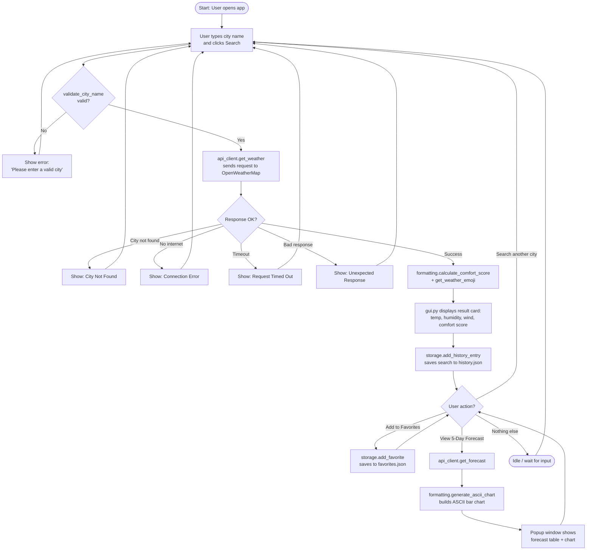

# 🌦️ Weather App — Personal Weather Dashboard

#### Video Demo: <https://youtu.be/HMwFgB3joEI?si=9yVJo80ipSLHrIMW>

#### GitHub: [Daniamageed](https://github.com/Daniamageed)

#### Description:

**Weather App** is a Python desktop application with a Tkinter GUI that lets
users check the current weather for any city, save their favorite cities,
keep track of their recent searches, and get a custom **Weather Comfort
Score** that rates how pleasant the weather actually feels — not just what
the temperature number says.

I built this as my final project for CS50P. My goal was to write something
that felt like a real, small application rather than a single script —
so instead of putting everything in one file, I split the project into
clearly separated modules, each with one job, and backed the core logic
with unit tests.

## ✨ Features

- **Live weather lookup** — search any city and instantly see the
  temperature, "feels like" temperature, humidity, wind speed, and a short
  description of the current conditions.
- **Celsius / Fahrenheit toggle** — switch units at any time without
  re-searching; the app converts and redisplays instantly.
- **Favorites** — save cities you check often, and reopen them with a
  double-click.
- **Search history** — automatically keeps your last 10 searches with a
  timestamp, so you can quickly revisit a city.
- **Weather Comfort Score (0–100)** — a custom metric I designed that
  combines temperature and humidity into a single "how comfortable is it
  outside right now" number, with a clear classification: *Comfortable*,
  *Hot*, *Cold*, or *Humid*.
- **5-day forecast** — a popup window showing one representative reading
  per day for the next 5 days.
- **ASCII bar chart** — a simple text-based chart inside the forecast
  window that visualizes the temperature trend without needing any
  external plotting library.
- **Robust error handling** — invalid city names, no internet connection,
  request timeouts, and unexpected API responses are all caught and shown
  to the user as clear messages instead of crashing the program.

## 🖥️ How the App Looks and Works

When you open the app, you type a city name and hit **Search** (or press
Enter). The result card updates with a weather emoji, the temperature, and
the Comfort Score. From there you can add the city to your favorites or
open the 5-day forecast window. Your last 10 searches and your favorite
cities are always visible on the main screen, and double-clicking either
one re-runs the search for that city.

## 📁 Project Files

This project follows a modular structure — every file has exactly one
responsibility, which made the code much easier to test, debug, and reason
about while I was building it.

### `project.py`
The entry point required by CS50P. It contains `main()`, which launches
the GUI, and it re-imports the core functions from the other modules
(`formatting.py` and `storage.py`) so they can be tested directly with
`from project import ...` in `test_project.py`.

### `api_client.py`
Everything related to talking to the [OpenWeatherMap](https://openweathermap.org/api)
API lives here: `get_weather()` for current conditions and `get_forecast()`
for the 5-day forecast. This module defines custom exceptions
(`CityNotFoundError`, `NetworkError`, `APITimeoutError`,
`InvalidAPIResponseError`) so the rest of the app can react to each failure
case with a specific, user-friendly message instead of a generic crash.
The API key is read from an environment variable using `python-dotenv`, so
it never has to be hard-coded into the source.

### `storage.py`
Handles all reading and writing of JSON data: adding/removing favorite
cities and saving the 10 most recent searches with a timestamp. Every
function accepts an optional file path, which is what made it possible to
unit-test storage behavior against a temporary file instead of the real
data files.

### `formatting.py`
The "pure logic" module — no network calls, no GUI code, just functions
that take inputs and return outputs. This is where I implemented:
- `celsius_to_fahrenheit()` / `fahrenheit_to_celsius()`
- `calculate_comfort_score()` — the required custom feature. It scores
  temperature and humidity separately against an "ideal range" (20–25°C
  and 40–60% humidity), combines them into a weighted score out of 100,
  and classifies the result.
- `validate_city_name()` — basic input validation before any API call is made.
- `generate_ascii_chart()` — builds the text-based bar chart for the
  forecast.
- `get_weather_emoji()` — maps a weather description to a matching emoji
  for the GUI.

Keeping this module free of side effects is what made it possible to
unit-test the app's core logic without needing an internet connection or a
running GUI.

### `gui.py`
Builds the entire Tkinter interface: the search bar, the result card, the
favorites and history lists, and the 5-day forecast popup with its ASCII
chart. This file only handles layout and user interaction — all the actual
logic is delegated to `api_client.py`, `storage.py`, and `formatting.py`.

### `test_project.py`
Seven unit tests covering temperature conversion, the comfort score
calculation, city name validation, favorites storage, search history
storage, the weather emoji mapping, and the ASCII chart generator. Run them
with:

```bash
pytest
```

### `requirements.txt`
Lists the external libraries the project depends on: `requests` (API
calls), `python-dotenv` (loading the API key), and `pytest` (testing).

### `.env` / `.env.example`
`.env` holds the real OpenWeatherMap API key and is excluded from version
control via `.gitignore`. `.env.example` is the template that shows what
variable needs to be set, without exposing any real key.

## 🧠 Design Decisions

A few choices I made along the way, and why:

- **Splitting the code into modules** instead of one big script made every
  piece testable on its own and much easier to debug when something broke.
- **Custom exceptions in `api_client.py`** instead of one generic
  `try/except` meant the GUI could show the *exact* right message for
  each failure — "no internet" and "city not found" are very different
  problems for a user.
- **Keeping `formatting.py` free of side effects** was the single decision
  that made unit testing possible without mocking the network or the GUI.
- **The Weather Comfort Score** was designed with a weighted formula
  (60% temperature, 40% humidity) because temperature has a bigger effect
  on how weather *feels* than humidity does on its own — but both still
  matter.

## ⚙️ Getting Started

```bash
# 1. Install dependencies
pip install -r requirements.txt

# 2. Set up your API key
cp .env.example .env
# then open .env and paste your key from https://openweathermap.org/api

# 3. Run the app
python project.py

# 4. Run the tests
pytest
```

> **Note:** `tkinter` ships with Python on most systems. If it's missing,
> install it separately (e.g. `sudo apt install python3-tk` on
> Ubuntu/Debian, or `brew install python-tk` on macOS) — it cannot be
> installed via `pip`.

## 🔄 Application Workflow

The diagram below shows how a single search flows through the app, from
input validation, to the API call and its possible error paths, all the
way to displaying the result and saving it to history.



## 🔗 Links

- **GitHub Repository:** <https://github.com/Daniamageed> *(https://github.com/Daniamageed/personal-weather-dashboard.git)*
- **Demo Video:** <https://youtu.be/HMwFgB3joEI?si=9yVJo80ipSLHrIMW>
